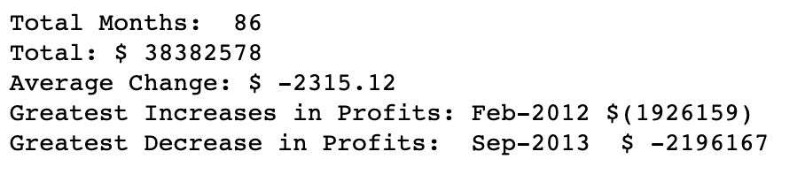
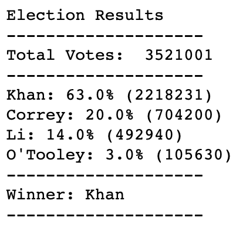
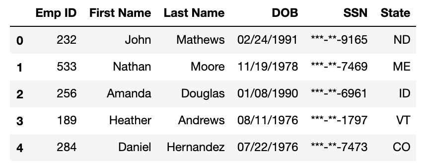
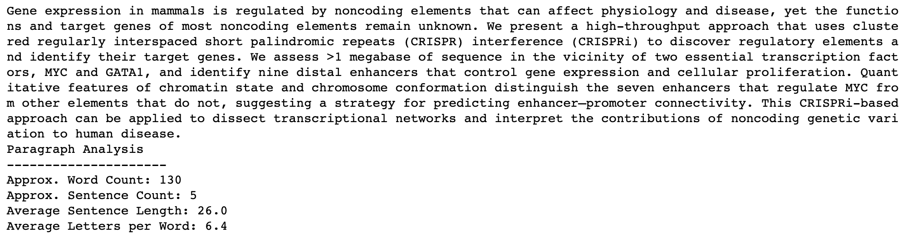

# python-challenge
These four python challenges aim at parametrizing simple datastreams (e.g. Profit/Losses, Votes, Employee Data, Text in Paragraphs). 

Matthew Richtmyer | 07 Dec 2019

## PyBank
* Description:
  - Analyze basic financial records for a company. Calculate greatest increases/decreases of profits from month to month and 
  characterize basic summary statistics
  
* Approach: 
  - Input csv data using pandas. 
  - Convert pandas.Series object to a numpy array to perform arithmetic operations (including the numpy.diff function)

* Code
  - 

* Output: 
  - 
  - Conveniently output text file using sys.stdout() which converts all print() function calls to a text file

## PyPoll
* Description: 
  - Analyze polling data for a sample district. 
  
* Approach: 
  - Input csv data into a DataFrame using pandas
  - Combine similar results using the df.groupby() function, allowing for simple aggregation of voting distributions across candidates
  - Convert groupby object into a dictionary to be able to iterate through and capture key/value pairs. Pull number of votes corresponding to each candidate and store these in a list for basic arithmetic manipulation (e.g. max, percentage of votes)
  
* Output: 
  - 
  - Conveniently output text file using sys.stdout() which converts all print() function calls to a text file
  
## PyBoss
* Description:
  - Reformat csv file containing employee information. Hide sensitive information (e.g. first 5 digits of SSN) and reformat other attributes to make the csv prettier. 
  
* Approach:
  - Input csv data using pandas as a DataFrame
  - Iterate through each column of DataFrame and perform string manipulations. Append these modified strings into seperate lists
  - Create a new DataFrame from a dictionary (keys - column names, values - lists of ammended strings)
  - Output DataFrame as csv file

* Output: 
  - 
 

## PyParagraph
* Description:
  - Automate description of text files
  
* Approach: 
  - Read in file using with open(filename, 'r') commands
  - Use RegEx expressions to define search pattern within text. Define pattern to search for periods/exclamation marks/question marks, followed by spaces and capital letters. This sequence will describe the sentence breaks. 
  - Split ther resulting strings and perform simple string manipulations to provide counts needed. 
  
* Output:
  - 
